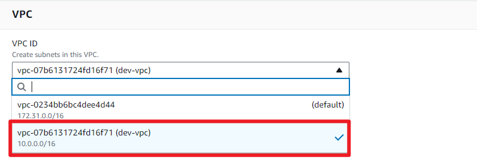
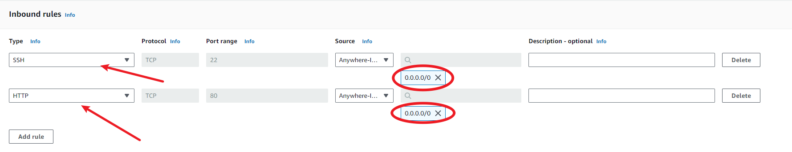

# Create custom VPC and all infrastructures required for a 2-tier architecture.<br>
This project involves 2 layers and they are 
- The presentation layer - This is where the webserver application resides, responsible for serving the user interface and handling user requests. In this case, one server is running this layer and called the webserver
- The data layer - This is where the database management system resides, which handles data storage, retrieval, and management. The second server is running MySQL for this project.

## Procedure

### Prerequisites
- AWS account
- Scripting knowledge

### Steps
1. Login to your AWS account and under services, search for VPC. and click create VPC

2. Use the vpc only, fill in the name of your vpc and choose a CIDR block 

3. Create a public subnet, although you will find some default subnets, but it might be necessary to cretae yours so as to have full control of your infrastructures. This is where the application server will reside, hence the need for internet access

4. choose your vpc from the dropdown menu and fill the necessary tabs as shown below 

choose an IP range from your selected CIDR block

5. Create another subnet, this will be a private subnet where the data server for the application will reside. Since we will not be accessing this server from the public, it is best to keep it in private subnet. Cjhoose another IP range from the same CIDR block but ensure they do not overlapp with the previous subnet created

6. For our subnet (public) to access the internet, we need to create an internet gateway. Still in VPC services, to the rigjht, search for internet gateway and click create

7. Give your internat gateway a name, and tag, then click on create

8. After creating the IGW, attach it to your VPC. This can be done either through the dropdown under actions or a popup just after successful creation.

9. Choose your VPC from the dropdown and attach the Internet Gateway 

10. Next is to create route tables, locate the route tables on the right hand side menu.

11. click on create route table 

12. The first route table will be a public route table, fil in the name of the routa table and choose your vpc from the dropdown and click create route table
.
13. Edit the route table by clicking edit route under the route tab

14. click on add route, and in the destination, choose 0.0.0.0/0 and under target, choose internet gateway

15. Choose the internet gateway created in step 8 and click save

16. Now is to edit subnet association, this is to attach the route table created to specific subnet, sice we are still working with the public subnet and the route table created is for public access, we will simply associate it to the public subnet by clicking edit subnet association under the subnet association tab

17. choose the public subnet and click save association

18. Next is to create NAT gateway. (Natgateway allow internet access to resources in the private subnet for activities requiring internet like updates, installation but limits access to public accessibility.)
19. from the right hand menu, locate NAT gateways

20. Click on create NAT gateway

21. give it a name, and select the subnet where the NAT gateway will reside, it is always in the public subnet in order to provide internet access to the private subnet

22. create route table for the private subnet following the same step as before

23. Edit the route table by clicking edit route under the route tab (ref step 13)
24. click on add route, and in the destination, choose 0.0.0.0/0 and under target, choose NAT gateway

25. Choose the NAT gateway created in step 18 and click save 

26. Edit subnet association by clicking edit subnet association under subnet association, then choose the subnet


27. Create security groups by clicking on create security group under Security on the right hand menu. The first is the SG for the application server which will be open to public, call it frontend SG


28. Fill in basic details- name of the SG and the VPC where it is needed

29. Edit inbound rules based on the traffic to be allowed into the resources, we will need SSH and HTTP traffic from anywhere since this is opened to the public

30. Create another security group which will be for the data server which is in private subnet, hence will nor be accessible to public, let's call it backend SG 

31. Edit the inbound rules to allow access only to the SG of the frontend SG, through SSH and MySQL port also through the front end SG

32. Launch EC2 instance 

33. Give the instance a name like web-server, and choose Red Hat AMI 

34. select an existing keypair or create a new one

35. Select the VPC created in step 2, select public subnet created in step 3, enable Auto-asiign public IP and select existing SG then choose the frontend SG

36. click on advanced settings, and scroll all the way down to userdata

37. Insert below userdata to be provisioned
```bash
#!/bin/bash
sudo yum update -y
sudo yum install httpd -y
sudo service httpd start
sudo chkconfig httpd on
cd /var/www/html
echo "<html><h1>This is my First Web Server</h1></html>" > index.html
sudo yum install mysql -y
```
38. After inserting the userdata, click on launch instance.
39. launch another EC2 instance, give it a name like mysql-server.

40. fill in the details as shown below but do not enable auto-assisgn public IP since this instance will be in the private subnet, also choose backend SG for this instance

41. use below userdate for this instance 
    ```bash
    #!/bin/bash
    sudo yum update -y
    sudo yum install mysql-server -y
    sudo yum install mysql -y
    sudo systemctl start mysqld
    sudo systemctl enable mysqld
    ```
42. Copy the IP of the first instance(web-server), paste in a browser, you should have a page like this 


43. On your SSH client (Gitbash or Mac terminal), change to the directory where you have your keypairs downloaded and copy the key into the webserver usinh secured copy protocol 

    ```
    scp -i webkey.pem webkey.pem ec2-user@13.40.35.156:/home/ec2-user
    ```
this is interpereted as 

    ```
    scp -i [yourkeypair] [filename] [username@targethost]:[targetpath]
    ```

43. it should look like this


44. Now that our key is in the webserver instance, ssh into the webserver


45. change the permission of the key that was copied into the webserver 

46. Now is time to ssh into the data server (MySQL server) ssh into it using the copied key using the private IP. 

47. Log into the MySQL database using the the default root user with the command below. Note, this will request for password, just press Enter 
    ```
    mysql -h localhost -u root -p
    ```

    
48. Create a user and password using below command 

49. Grant privileges the newly created user and flush the privileges

50. Exit the SQl and the server altogether

51. login remotely from the webserver 

52. run the database to see the default databases


